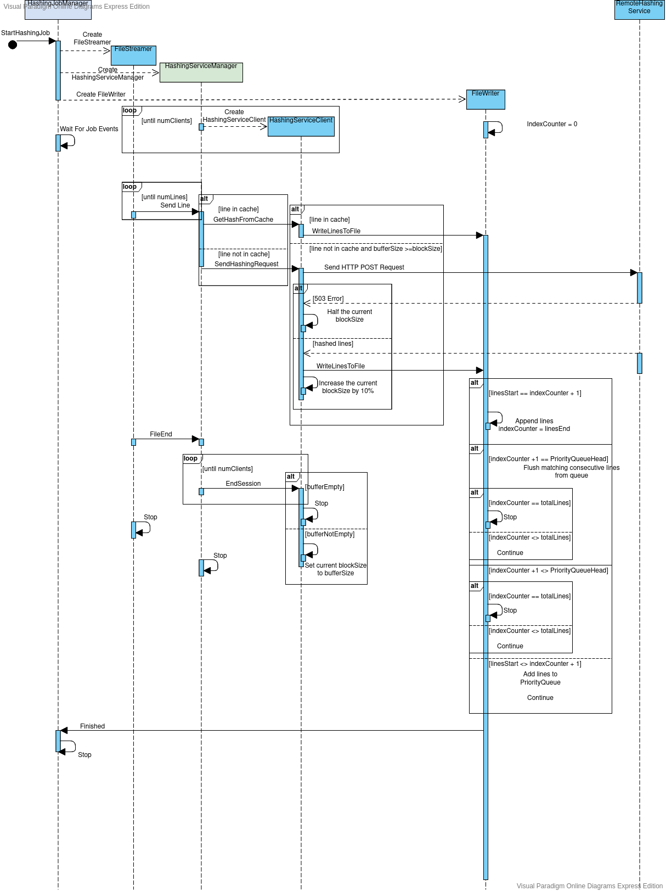

# ING Technical-Assessment - ML Platform


## Hashing-as-a-Service: 
The purpose of this application is to build a simple [CLI](https://en.wikipedia.org/wiki/Command-line_interface) application that computes the hash of the content of a text file line-by-line and writes it to an output file (provided from command line). For instance:
``` $ compute-hash ./input.txt ./output.txt```
Given `input.txt` as follows:
```
a
b
…
```
The `output.txt` should be :
```
hash-of-a
hash-of-b
…
```
Note that, due to implementation details and underlying network, there could be latency in responding to a request and also, that it can fail.

Example of error response: `HTTP 503 (Service Unavailable)`.

```
{
    "error": "Something went wrong!"
}
```

Detail of the service and how to run it is available [https://github.com/mlplatform/hashing-as-a-service](https://github.com/mlplatform/hashing-as-a-service).

In this assignment we will reuse this service and build this CLI application.

# Objectives + Technical Constraints 

0. Objective: _To derive a low latency and high throughput soluation_ to the problem with Actor-based concurrency and Functional Programming. 
1. Key Focuses: **out-of-order event handling of responses**, error handling, non-blocking solution to the problem.   
2. Please solve this problem using [Scala](https://www.scala-lang.org/) and Akka [Actors](https://doc.akka.io/docs/akka/current/actors.html).  
3. Note: You are **not allowed** to use any stream processing library (e.g., FS2, Akka Stream etc) as that would make the problem quite simple to solve due to the primitive provided.
4. You are allowed to use any libraries. However, please prefer to minimise the dependencies as much as possible.
5. Please consider a non-seekable output file stream (e.g., please do not use `RandomAccessFile`).  

# Implementation Details
#### Languages Used: 
  - ##### Scala Version 2.13.3
#### Libraries Used
  - ##### [Akka Actors Typed](https://doc.akka.io/docs/akka/current/typed/actors.html)
  - ##### [Circe](https://circe.github.io/circe/)
  - ##### [Sttp Client](https://sttp.softwaremill.com/en/latest/)
  - ##### [MapDB](http://www.mapdb.org/)
  - ##### [ScalaTest](https://www.scalatest.org/)

#### Implementation
  - The implementation of the core logic is centered around the following functional requirements:
    - File I/O,
    - Parallelized **non-blocking** HTTP API consumption with focus on **high throughput**
    - **Out-of-order event handling of responses**
    - Error handling of:
        1. Network Errors e.g. ***503 error***
        2. Internal application errors related to e.g. ***JSON encoding/decoding, File I/O***
    
  - The implementation is based on Akka Actor Model, where each actor is responsible for one aspect of each of the functional requirements.
  - The following is the sequence diagram of the actors involved in the hashing pipeline:
  #### Sequence Diagram
 
 #### Actors Description
 1. ##### HashingJobManager:
    - The ***HashingJobManager*** actor is responsible for driving the complete hashing job. The lifecycle of this actor is outlined as follows:
        1. Starts the [FileStreamer](./src/main/scala/com/ing/hashingserviceclient/cli/actors/FileStreamer.scala) child actor.
        2. Starts the [HashingServiceManager](./src/main/scala/com/ing/hashingserviceclient/cli/actors/HashingServiceManager.scala) child actor.
        2. Starts the [FileWriter](./src/main/scala/com/ing/hashingserviceclient/cli/actors/FileWriter.scala) child actor.
        3. Waits for hashing job events as defined at [HashingJobProto.scala](./src/main/scala/com/ing/hashingserviceclient/cli/domain/HashingJobProto.scala)
 2. ##### FileStreamer:
    - The ***[FileStreamer](./src/main/scala/com/ing/hashingserviceclient/cli/actors/FileStreamer.scala)*** actor is responsible for streaming the lines of the input file to the [HashingServiceManager](./src/main/scala/com/ing/hashingserviceclient/cli/actors/HashingServiceManager.scala) actor.
    - It follows the protocol defined at [FileStreamProto.scala](./src/main/scala/com/ing/hashingserviceclient/cli/domain/FileStreamProto.scala).
 3. ##### HashingServiceManager:
    - The ***[HashingServiceManager](./src/main/scala/com/ing/hashingserviceclient/cli/actors/HashingServiceManager.scala)*** actor is responsible for spawning configurable number of instances of [HashingServiceClient](./src/main/scala/com/ing/hashingserviceclient/cli/actors/HashingServiceClient.scala)  actors. 
    - It shards the incoming lines from [FileStreamer](./src/main/scala/com/ing/hashingserviceclient/cli/actors/FileStreamer.scala) actor to be sent to each instance of the child [HashingServiceClient](./src/main/scala/com/ing/hashingserviceclient/cli/actors/HashingServiceClient.scala) in ranged partitions in order to distribute the workload. This is the main approach to achieve **parallelism and high throughput** via ***message-based parallelism*** using actors.
    - It follows the protocol defined at [FileContentProto.scala](./src/main/scala/com/ing/hashingserviceclient/cli/domain/FileContentProto.scala).
    - Internally it keeps track of lines sent to [HashingServiceClient](./src/main/scala/com/ing/hashingserviceclient/cli/actors/HashingServiceClient.scala) using a set.
    - If a line has been seen before, it commands the [HashingServiceClient](./src/main/scala/com/ing/hashingserviceclient/cli/actors/HashingServiceClient.scala) to get the hash for the line from cache, otherwise from remote hashing service.
 4. ##### HashingServiceClient:
    - The ***[HashingServiceClient](./src/main/scala/com/ing/hashingserviceclient/cli/actors/HashingServiceClient.scala)*** actor is responsible for handling hashing requests sent by the [HashingServiceManager](./src/main/scala/com/ing/hashingserviceclient/cli/actors/HashingServiceManager.scala) parent actor. 
    - It buffers received requests until the number of lines reaches the configured/adjusted block size. 
    - The lifecycle of this actor is outlined as follows:
        1. Sends a *HTTP POST* request to the remote hashing service if the size of buffer reaches the configured/adjusted block size.
        2. If the received response from the remote service is ***503*** then reduces the block size by ***50%*** and retries this step.
        3. If the received response from the remote service contains hashed lines then:
            - Sends them to the [FileWriter](./src/main/scala/com/ing/hashingserviceclient/cli/actors/FileWriter.scala) actor.
            - Clears the used buffer while retaining the unused buffer.
            - Increases the block size by ***10%*** as an optimistic behaviour.
            - Goes to first step.
        8. If a ***EndSession*** command is received:
            - If the current buffer is empty then stop.
            - Else send ***EndSession*** command to self to consume again later.
            - Resume from third step with the block size adjusted to the size of the buffer.
     - This actor follows the protocol defined at [HashingServiceClientProto.scala](./src/main/scala/com/ing/hashingserviceclient/cli/domain/HashingServiceClientProto.scala).
 5. ##### FileWriter:
    - The ***[FileWriter](./src/main/scala/com/ing/hashingserviceclient/cli/actors/FileWriter.scala)*** actor is responsible for ordering and appending the hashed lines received from the [HashingServiceClient](./src/main/scala/com/ing/hashingserviceclient/cli/actors/HashingServiceClient.scala) actor(s) to the output file. 
    - The ***out-of order ordering*** is done by internally buffering the out-of-order hashed lines in a ***PriorityQueue***.
    - It follows the protocol defined at [FileWriteProto.scala](./src/main/scala/com/ing/hashingserviceclient/cli/domain/FileWriteProto.scala).
    - The working of the file writing process is outlined as follows:
        1. The received hashed lines are only written/appended after matching each line number with a counter to keep track of the last written line number.The counter is also incremented to the last line number of the received lines.
        2. If the received hashed lines have the ending line number immediately leading the head of the **PriorityQueue** then the lines from the queue are written up to the last matching consecutive line number of the incrementing counter.
        3. If the counter becomes equal to the total number of lines, then the actor closes the output file and stops.
            
          
# Running the CLI Application:
## Requirements:
    - Java 8 should be installed on the Host Machine for running the tests.
    - SBT > 1.0 should be installed if running using sbt.
    - The hashing-as-a-service application is assumed to be running before on http://localhost:9000
# Steps to run the code
### 1. Running from distribution:

- The following shell command can be used to run the cli application from inside the ***dist*** folder:
 ```shell 
bin/compute-hash ./input.txt ./output.txt
```
- ***Note:*** The **input.txt** and ***output.txt*** files must be present and modified in the ***dist*** folder.

### 2. Running using SBT:

- The following shell command can be used to run the cli application from the ***project root*** folder.
 ```shell 
sbt "run ./input.txt ./output.txt"
```
- ***Note:*** The **input.txt** and ***output.txt*** files must be present and modified in the ***project root*** folder.

 * **Author:** Saad Hashmi
 * **Version:** 1.0
 * **Date:** 2020-09-13
